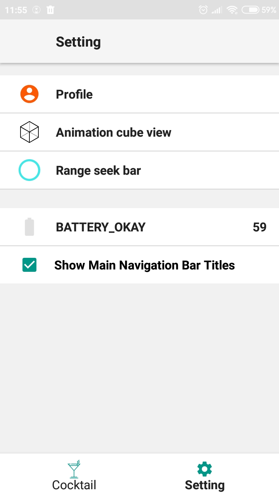
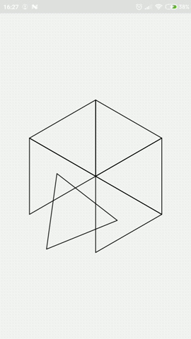
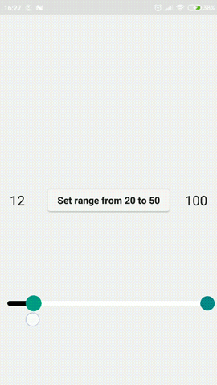

# TheCocktailDbApp

### [Work in progress]

This project demonstrate my skills in Android development. 

The main purpose of this app is to find, view, save, sort and filter cocktails using public [API](https://www.thecocktaildb.com/api.php). In addition to this I add
authentication (which currently use mocked API), some custom views and usage of firebase services.

This project includes following architecture concepts:
+ Multi-module architecture (classic division by layers following CLEAN guidelines)
+ Single-Activity architecture
+ Model-View-ViewModel presentation pattern (using only coroutines Flow instead of LiveData)

## Briefly description of main features

### Authentication
When user install application he needs to sign in their account or register new one. Currently work with this API perform through mocked responses.
Login | Register |
-------------------- | -------------------- |
 |  |

### Cocktail
Big part of application focused to work with cocktails. For this I use this public [API](https://www.thecocktaildb.com/api.php). There are two cocktails lists:
+ In History tab you can see all previously viewed cocktails
+ In Favorite tab you can see cocktails marked as favorite

Using search or through notification user can view cocktail details and thus populate cocktails list. He can also add cocktails to favorite and thus populate favorite cocktails list.

In addition user can filter (by alcoholic, category or glass) and sort (by history, cocktail name, alcohol amount and number of ingredients) cocktails.

After user view cocktail details, on the main page appear message that prompt him to view different cocktail from his list.

User can optionally delete cocktail from the list.

Main coktail tab | Favorite cocktail tab | Cocktail filter 
--------------------- | --------------------- | --------------------- 
 |  | 

Cocktail sort | Cocktail proposal | Cocktail search
--------------------- | --------------------- | --------------------- 
 |  | 

Cocktail details expanded | Cocktail details collapsed | 
--------------------- | --------------------- | 
 |  |

### Setting
This screen mostly created to demonstrate features that weren't related to cocktails. It leads to 3 additional screens: Profile, Cubic Animation view and Range Seek Bar view.

In addition there is a row which shows the battery status: battery charge as a percentage, indication of current battery charge status and constant which represents how good
battery charged (usually when battery level fall behind 20% this constant will show BATTERY_LOW).

The last row in this screen gives ability to change visibility of bottom navigation titles (Cocktail and Setting signs in bottom navigation view).

Setting | 
-------------------- | 
 |

### Profile
In this screen user can view and change his profile data. He can change name, last name, email and profile photo. User can logged out from his account, if desired.

Profile | Profile log out dialog |
-------------------- | -------------------- |
 |  |

### Cube Animation view
This screen created to demostrate my skills in creating complex animation. You can change following parameters in this custom view:
+ thickness and color of lines 
+ add points showing and change their color or size
+ turn on and off playback of any animation
+ duration of any animation
+ delay between animations
+ interpolators

Cube animation | 
-------------------- | 
 |

### Range Seek Bar view
This screen created to demostrate my skills in creating complex custom view. Following parameters could be changed:
+ minimum and maximum value
+ color, thickness or gradient for any line type
+ color and size of active and inactive slider
+ rounded or straight edges for background line
+ setting range via animation 

Range seek bar | 
-------------------- | 
 |

### Firebase

#### Notification
Currently supported notification:
+ notification to main cocktail screen
+ notification to profile screen
+ notification to details of a certain cocktail. In case where id of such cocktail was not found, user will be returned to main screen and show him corresponding message.

If you want to test notification then download following postman collection [file](https://www.getpostman.com/collections/96c3c8318fac9657d9a7).

#### Dynamic links
Currently supported dynamic links:
+ [Link](https://thecocktaildb.page.link/?link=https://example.com/?type%3Dcocktail&apn=com.test.thecocktaildb&afl=https://github.com/ZelinskiyPavlo/TheCocktailDbApp)
to main cocktail screen.
+ [Link](https://thecocktaildb.page.link/?link=https://example.com/?type%3Dprofile&apn=com.test.thecocktaildb&afl=https://github.com/ZelinskiyPavlo/TheCocktailDbApp)
to profile screen.
+ [Link](https://thecocktaildb.page.link/?link=https://example.com/?type%3Dcocktail_detail%26id%3D11007&apn=com.test.thecocktaildb&afl=https://github.com/ZelinskiyPavlo/TheCocktailDbApp)
to details of a certain cocktail. In case where id of such cocktail was not found, user will be returned to main screen and show him corresponding message.

**Note**: both notification and dynamic links can work as deferred deep link. This happens when user not authenticated. In such case deep link data saved in-memory and will be
executed when user complete authentication. 

#### Analytics
List of events, that logged in analytic:
+ Adding cocktail to favorite
+ Deleting cocktail from favorite
+ Opening cocktail details screen
+ Filtering cocktails
+ Changing bottom navigation tab
+ Changing user avatar
+ Changing user data

### 3rd party libraries that was used:
+ Dagger (with ability to use dagger-reflect)
+ Cicerone
+ Retrofit
+ Room
+ Data binding (need migration to view binding)
+ Lifecycle components
+ Firebase 
  + Analytics
  + Crashlytics
  + Dynamic links
  + Firebase messaging
+ Glide

### Major future changes:
- [x] Replace liveData with kotlin coroutines (in whole or in part)
- [ ] Move navigation logic and firebase logic from fragment to ViewModel
- [ ] Implement data security
- [ ] Rework UI using Jetpack Compose
- [ ] Rewrite business logic using KMM
- [ ] Create own real API
- [ ] Add drawing images behind status bar

and other...
